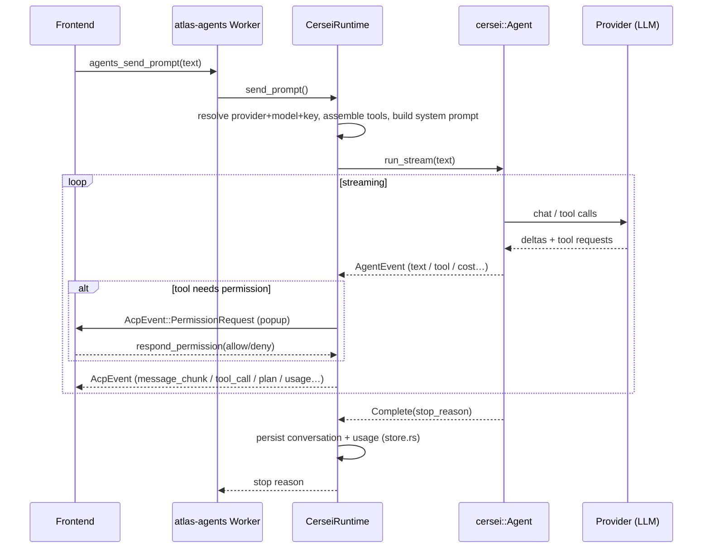

# Atlas (`atlas-cersei`) — the native in-process agent

> A plain-language walkthrough of how Atlas's own coding agent is built, how a
> turn flows end-to-end, and every tool it can use. Source: `crates/atlas-cersei/`.

---

## 1. The one-paragraph version

Atlas ships **three** AI agents you can pick in the chat: **Claude Code**, **Codex**,
and **Atlas**. The first two are *external programs* Atlas launches as subprocesses
and talks to over the **ACP** wire protocol (JSON-RPC). **Atlas** (this crate, code
name *Cersei*) is different: it runs **inside the Atlas process itself**. There is no
subprocess and no socket. It drives the **Cersei agent SDK** directly, and then
**translates** the SDK's event stream into the *exact same* `AcpEvent` shapes the real
ACP agents emit. That one trick — "look like ACP without being ACP" — is the whole
design: everything downstream (state, streaming, tool cards, permission popups, the UI)
is reused unchanged.

```
Claude Code  ─┐   subprocess  ┌─ speaks real ACP over JSON-RPC ─┐
Codex        ─┤   subprocess  ┘                                 ├─▶ same AcpEvent stream ─▶ same UI
Atlas        ─┘   in-process, drives Cersei SDK, FAKES AcpEvent ┘
```

---

## 2. Where it sits in the stack

```
┌──────────────────────────────────────────────────────────────────────┐
│ React frontend  (agent picker, chat, tool cards, permission popups)    │
└───────────────▲──────────────────────────────┬────────────────────────┘
        listen("atlas:agents")          invoke("agents_*")
                │                                ▼
┌───────────────┴────────────────────────────────────────────────────────┐
│ src-tauri/src/commands/agents.rs   (IPC verbs; registers memory search)  │
└───────────────▲──────────────────────────────┬─────────────────────────┘
                │                                ▼
┌───────────────┴────────────────────────────────────────────────────────┐
│ atlas-agents  — AgentManager + SessionWorker  (agent-agnostic)           │
│   backend.rs:  trait AgentBackend                                        │
│      ├─ AcpBackend     → atlas_acp::AgentRegistry   (Claude Code, Codex)  │
│      └─ CerseiBackend  → atlas_cersei::CerseiRuntime (Atlas)  ◀───────┐   │
└──────────────────────────────────────────────────────────────────────┼──┘
                                                                        │
┌───────────────────────────────────────────────────────────────────── ┴──┐
│ atlas-cersei  (THIS CRATE)                                                │
│   lib.rs       CerseiRuntime — sessions, turn loop, event translation     │
│   provider.rs  BYOK (provider,model,key) → cersei Provider                │
│   tools/       Atlas-owned basic tools (Read/Write/Edit/Grep/Glob/List/Bash)│
│   mcp.rs       connect MCP servers, expose their tools                    │
│   memory.rs    `search_memory` RAG tool (backend injected from Tauri)     │
│   context.rs   git snapshot + AGENTS.md/CLAUDE.md → system prompt          │
│   store.rs     persist/list/delete sessions on disk; read BYOK keys       │
└───────────────────────────────▲──────────────────────────────────────────┘
                                 │ drives directly
                  ┌──────────────┴───────────────┐
                  │ cersei::Agent  (external SDK) │  ← the actual agentic loop
                  └──────────────┬───────────────┘
                                 ▼
                   Anthropic / OpenAI-compatible provider (your BYOK key)
```

The seam that makes two very different agents interchangeable is the
`AgentBackend` trait in `atlas-agents/src/backend.rs`. The manager/worker only ever
call that trait. `CerseiBackend` is a thin wrapper that forwards each call into
`CerseiRuntime`. So Atlas is "an ACP agent" from the manager's point of view, even
though under the hood it never speaks ACP on a wire.

---

## 3. The files, one line each

| File | Lines | Job |
|------|------:|-----|
| `lib.rs` | 1555 | The runtime: session registry, the **turn loop** (`send_prompt`), the **event translator** (`translate_event`), and the **permission policy**. |
| `store.rs` | 396 | Save / load / list / delete sessions as JSON on disk; read BYOK keys. |
| `provider.rs` | 139 | Map `(provider, model, key)` → a boxed Cersei provider; default-model table + priority order. |
| `mcp.rs` | 110 | Connect configured MCP servers, surface their tools to the model. |
| `context.rs` | 106 | Build the per-turn repo context (git status + project docs) for the system prompt. |
| `memory.rs` | 95 | The `search_memory` RAG tool (retrieval backend injected from the Tauri layer). |
| `tools/` | — | **Atlas-owned coding tools** (from-scratch, opencode-modeled): `Read/Write/Edit/Grep/Glob/List/Bash` + the 9-strategy replacer (`replace.rs`), L0 coercion (`coerce.rs`), corrective errors (`errors.rs`), truncation spill (`truncate.rs`), and the `cwd.rs` resolver/`CwdTool` (which folds the former `cwd_tool.rs`). `atlas_coding()` (`tools/mod.rs`) is the toolset seam. See `tools/ATTRIBUTION.md`. |

---

## 4. Core idea #1 — adapting Cersei events to `AcpEvent`

The Cersei SDK streams its own events (`AgentEvent`) as a turn runs. `translate_event`
in `lib.rs` converts each one into the `AcpEvent` the rest of Atlas already understands.
This adapter is the part most likely to harbor bugs, so it's split out and unit-tested
with scripted events (no provider, no network — see the `tests` module at the bottom of
`lib.rs`).

| Cersei `AgentEvent` | Emitted `AcpEvent` / action |
|---------------------|------------------------------|
| `TextDelta` | `agent_message_chunk` (streaming assistant text) |
| `ThinkingDelta` | `agent_thought_chunk` (streaming reasoning) |
| `ToolStart` (normal) | `tool_call` card (`in_progress`) |
| `ToolStart` **TodoWrite** | a **plan card** (`plan` update), *not* a tool card |
| `ToolEnd` | `tool_call_update` (`completed`/`failed`) + measure RTK savings |
| `ToolEnd` for a TodoWrite id | **suppressed** (plan card already shown) |
| `CostUpdate` | `Usage` event (tokens + cost) |
| `CompactStart` / `CompactEnd` | `Compaction { active: true/false }` |
| `TurnComplete` | set stop reason, keep looping |
| `Complete` | set stop reason, **end** the turn |
| `Error` | fail the turn (caller decides cancel-vs-propagate) |

Tool names are also mapped to a UI icon category by `tool_kind()` (read / edit /
execute / fetch / other).

---

## 5. Core idea #2 — a turn, start to finish (`send_prompt`)

This is the heart of the crate. When you hit send:

```
 user prompt ─▶ CerseiRuntime::send_prompt(agent_id, session_id, text)
   │
   1. Resolve provider + model for the session; look up its BYOK API key.
   │      (no key / no model → friendly error pointing at Settings → API Keys)
   2. Build the provider           (provider.rs::build_provider)
   3. Assemble the TOOLSET  ───────────────┐  (see §6)
   4. Build the SYSTEM PROMPT:              │
   │     ATLAS_GUIDANCE (behavior)          │
   │   + git snapshot  (context.rs)         │
   │   + cwd + AGENTS.md/CLAUDE.md          │
   │   + the tool list + MCP notes          │
   5. cersei::Agent::builder()              │
   │     .provider / .tools / .working_dir  │
   │     .with_messages(history)   ← resume context
   │     .permission_policy(UiPolicy)  ← popups
   │     .cancel_token / .model / .max_turns(50)
   │     .auto_compact(true)               │
   │     .compression_level(RTK on/off)    │
   │     .thinking_budget(...)  ← Anthropic only, from "effort"
   │                                        │
   6. stream = agent.run_stream(text)       │
   │     for each AgentEvent:               │
   │         translate_event(...)  ─────────┘ emits AcpEvents through the sink
   │         (loop until Complete / Error / cancel)
   │
   7. Emit RTK "CompressionSaved" for the turn
   8. Fold this turn's tokens/cost into the session's cumulative usage
   9. Persist updated conversation to disk   (store.rs::save)
   └─▶ return the stop-reason token ("endturn" / "maxtokens" / "cancelled" / "refusal")
```

### Sequence diagram



A subtle but important detail: Cersei **rebuilds the agent each turn**, so its
cumulative token counters reset every turn. The runtime therefore keeps its **own**
running total (`CompressAccount` + `SessionEntry.usage`) so "tokens processed"
survives a reload.

---

## 6. The tools — what Atlas can actually do

The toolset is assembled fresh **per turn** in `send_prompt`. It is the union of:

```
   crate::tools::atlas_coding()   ← Atlas-owned basic tools + retained SDK tools
 + cersei::tools::planning()      ← EnterPlanMode, ExitPlanMode, TodoWrite
 + DelegateTool                   ← spawn parallel in-process sub-agents
 + SearchMemoryTool   (if a RAG backend is registered)
 + MCP proxy tools    (one per tool discovered on each connected MCP server)
```

### 6a. Coding tools (`crate::tools::atlas_coding()`)
The basic file/search/shell kit is **Atlas-owned** (a from-scratch reimplementation
modeled on opencode, MIT — see `src/tools/` + `tools/ATTRIBUTION.md`), so it works
reliably across every BYOK model rather than only strong ones:
**Read / Write / Edit / Grep / Glob / List / Bash**. The crown jewel is `Edit`'s
**9-strategy replacer** (`replace.rs`): a slightly-off `old_string` (indentation /
whitespace / line-ending / escape drift) still lands on the right span, with a guarded
fuzzy tail (unique + not-oversized) and a 2026 destructive-match guard so a wrong edit is
never silently applied; on a genuine miss it returns a corrective error showing the real
nearby lines. `atlas_coding()` (`tools/mod.rs`) is an explicit, hand-built vector, so any
tool can be swapped for an SDK fallback by flipping one line. Retained SDK tools (not
reimplemented): `WebFetch / WebSearch / ExaSearch / ApplyPatch / CodeSearch / PowerShell`,
plus `NotebookEdit`.

### 6b. cwd resolution (`tools/cwd.rs`) — a real bug fix worth knowing
The SDK's file tools resolve `file_path` with a bare `Path::new(...)`, **ignoring** the
working directory. A relative path (what the model naturally produces) would resolve
against the *app bundle*, not your project → "File not found" → the model falls back to
`cat` via shell. Atlas's own tools resolve relative paths internally via
`cwd::resolve_path(ctx.working_dir, …)`. Retained SDK tools that still ignore the cwd are
wrapped in `CwdTool` (verified: **NotebookEdit**); `ApplyPatch` already joins
`working_dir`, so it is left raw. (`cwd.rs` folds the former top-level `cwd_tool.rs`,
which has been deleted.)

### 6b-i. Search backend — ripgrep
`Grep / Glob / List` shell out to **ripgrep (`rg`)** via `spawn_blocking` (gitignore-aware,
matches opencode). If `rg` is not on `PATH` they return a **hard error** — never a silent
literal-substring fallback (which would give wrong results for a real regex). `rg` must be
installed in dev and **bundled with the packaged `.app`** (an open packaging follow-up).

### 6c. Planning tools (`cersei::tools::planning()`)
`EnterPlanMode` / `ExitPlanMode` / `TodoWrite`. **TodoWrite is special**: instead of
rendering as a raw tool card, the runtime maps it to an ACP **plan card** (the same
live to-do surface Claude Code uses). See `emit_plan`.

### 6d. `delegate` — parallel sub-agents
The `DelegateTool` (from `cersei-agent`) lets Atlas spawn **parallel in-process
sub-agents** — like Claude Code's *Task* or Codex's *spawn_agent*. Each child:
- gets a **fresh conversation** + the **same coding toolset** (also cwd-wrapped),
- runs on the **same provider/model** (rebuilt via a `ProviderFactory`),
- **cannot delegate further** (depth-capped — children can't spawn children),
- runs **concurrently** (the batch runs several at once) and reports a summary back.

### 6e. `search_memory` — RAG grounding (`memory.rs`)
A read-only tool that searches Atlas's **indexed project memory** (prior decisions,
conventions, codebase summaries) and returns the most relevant snippets. The seam
is frozen and unchanged: `MemDoc { title, source, text }` +
`MemorySearchFn(cwd, query, limit) -> Vec<MemDoc>`, injected via a registered async
callback (`register_memory_search`, wired in `commands/agents.rs`). The closure
takes **no agent-type parameter**, so all three agents (Claude Code / Codex /
Cersei) ground through the exact same retrieval path. Until the backend is
registered, the tool simply isn't added.

**What backs the callback** (rebuilt — see `plans/atlas-cersei-rag-replan.md` and
`crates/atlas-memory/MIGRATION.md`): a new low crate **`atlas-memory`** (no Tauri,
never depends on `atlas-cersei`) owns a per-project `MemoryEngine`:

- **On-device MiniLM → usearch HNSW.** `MiniLmProvider` (Cersei's `EmbeddingProvider`
  trait, wrapping `atlas-embed`'s 384-d CPU MiniLM) feeds a persistent
  `usearch 2.25.3` HNSW index — replacing the old in-Tauri **brute-force O(n)
  cosine** over a flat `memory-index/index.json`. A micro-benchmark (Step 10) put
  HNSW at ~120× the brute-force query throughput on a 4k-vector corpus. The default
  retrieve path performs **no network call**.
- **Decoupled indexing.** A single background `MemoryIndexer` (Tokio task + debounce
  + FS watcher, in the Tauri layer) does ALL embedding/persistence off the chat hot
  path, across all open projects, keyed by `cwd`. This fixes the old "index never
  rebuilt mid-session" staleness bug.
- **Graph memory.** Cersei `GraphMemory` (Grafeo) holds structured facts /
  relationships / topic tags as a **down-weighted** secondary contributor; the
  embedding side stays the authoritative recall path.
- **Fused retrieve.** `MemoryEngine::retrieve` applies the 0.30 cosine floor on the
  raw similarity, RRF-fuses embedding + graph, Jaccard-dedups, and (only when local
  memory is sparse) blends low-weight global cross-project hits.
- **Gated extraction + global memory.** Native session extraction (behind the
  default-OFF `ATLAS_NATIVE_EXTRACTION` flag, A/B'd against the legacy
  `memory_compile` distill) and AutoDream consolidation feed a global store under
  `~/.atlas/memory/`.

The legacy brute-force `memory_retrieve` path and the `memory_compile` distill are
**retained as documented rollback fallbacks** pending live runtime validation.

### 6f. MCP tools (`mcp.rs`)
Cersei 0.1.9 collects MCP server configs but never connects them, so this crate drives
`cersei::mcp` itself: it reads `<config_dir>/mcp-servers.json`, connects the servers
**once** (cached for the app session), and exposes each discovered tool as a normal
Cersei tool that proxies calls to the server. MCP tools are treated as `Execute`
permission level (arbitrary third-party code → they prompt unless you're in Bypass).

---

## 7. Permission modes — who gets to ask before acting

Every tool call passes through `UiPolicy::check`. The session has a **mode**, and the
mode decides whether the tool runs silently, is blocked, or pops a permission request
to the UI.

```
                         ┌──────────────────────────────────────────────┐
  tool wants to run ───▶ │  mode_kind(session.mode)                      │
                         └──────────────────────────────────────────────┘
                            │           │            │            │
                         Bypass        Plan      AcceptEdits      Ask (default)
                            │           │            │            │
                    allow  everything   │      allow file edits   │
                            │      allow read-only  & reads;       │
                            │      deny writes      prompt for     │
                            │      ("read-only")    shell/danger   │
                            │                                      │
                            ▼                                      ▼
                       (no popup)                    Forbidden? → auto-deny
                                                     else → POPUP, block tool,
                                                            await user decision
```

The four advertised modes (`modes_blob`): **Ask** (`default`), **Accept edits**
(`acceptEdits`), **Plan** (`plan`), **Bypass** (`bypass`).

A neat robustness detail: `mode_kind()` **normalizes aliases** from other agents'
vocabularies — `bypassPermissions` (Claude), `danger-full-access` (Codex), `read-only`,
`auto`, etc. — so a mode id seeded by a cross-agent picker still does the right thing.
(This fixed a real bug where "Bypass" silently fell through to prompting on every action.)

When a popup is needed: the policy mints a request id, stashes a `oneshot` sender in
`SessionEntry.pending`, emits `AcpEvent::PermissionRequest`, and **blocks the tool** on
the channel until `respond_permission` (allow once / allow for session / reject) or a
cancel resolves it.

---

## 8. Providers & BYOK (`provider.rs` + `store.rs`)

Atlas is **bring-your-own-key**. Keys live in `<config_dir>/byok-keys.json` (written by
the Tauri `byok_*` commands; this crate only reads them).

- **Anthropic** → native `Anthropic` provider.
- **Everything else** (OpenAI, Google, xAI, DeepSeek, Mistral, Groq, Together,
  Fireworks, DeepInfra, Cerebras, Perplexity, OpenRouter, Cohere) → the
  **OpenAI-compatible** client with a per-provider base URL.

When a session opens and the UI hasn't pinned a model, the runtime auto-picks the first
configured provider by **priority** (`PROVIDER_PRIORITY`, Anthropic first) and its
default coding model (`default_model_for`). `set_model` accepts `"provider/model"` or a
bare model id, and is careful not to mis-split model ids that legitimately contain a
slash (e.g. `Qwen/Qwen3-Coder`).

**Reasoning effort** (low/medium/high/max) maps to a **thinking budget**, applied
**only for Anthropic** (the only provider exposing a usable per-request budget today).

**RTK compression** (`cersei-compression`) shaves tool-output tokens — `Minimal` when
on (safe savings, the default), `Off` when the user disables it. The runtime mirrors
the same compression to *measure* and report savings, because the SDK applies it but
never reports the number.

---

## 9. Persistence & resume (`store.rs`)

Sessions are stored as JSON at:

```
<config_dir>/cersei-sessions/<cwd-hash>/<session_id>.json
```

- `<cwd-hash>` namespaces sessions **per project** (a `DefaultHasher` of the cwd).
- The file holds the raw Cersei conversation + provider/model + cumulative usage.
- **Resume**: `load_session` feeds the stored messages back via `Agent::with_messages`
  so context continues; `replay_session` rebuilds a UI-neutral transcript
  (`ReplayItem`s) so the chat repaints on reload.
- **Sidebar**: `list()` returns `SessionMeta` shaped *exactly* like the frontend's
  `ClaudeSessionMeta` (same as Codex), so all three agents merge into one session list
  with no special-casing.
- **Corpus**: `corpus_sessions()` flattens conversations so Atlas's own chats are
  searchable in Memory ▸ Chat / Graph (parity with Codex threads).
- **Delete** guards that the resolved path stays inside `cersei-sessions` before
  removing; a missing file is treated as success.

---

## 10. System prompt — grounding the agent in *your* repo (`context.rs`)

Each turn, `build_system_prompt` is fed:
- **`ATLAS_GUIDANCE`** — the behavioral spec (explore before acting, parallel tool
  calls, when to use TodoWrite/delegate/search_memory, "do, don't just explain", be
  concise). It's worth reading at the top of `lib.rs` — it's the agent's personality.
- **git snapshot** — branch, last 10 commits, up to 40 dirty files, user name.
- **project docs** — `AGENTS.md` and `CLAUDE.md` (each capped at 8 KB).
- **the live tool list** + per-server MCP notes.

So the agent isn't running off a static prompt — every turn it's re-grounded in the
actual repo state.

---

## 11. Mental model / cheat-sheet

- **It's not really ACP.** It's an in-process Cersei agent wearing an ACP costume so it
  can reuse Atlas's whole agent pipeline.
- **`lib.rs` is 90% of it.** `CerseiRuntime` (state + turn loop) + `translate_event`
  (the costume) + `UiPolicy` (permissions).
- **Tools = `coding()` + `planning()` + `delegate` + `search_memory` + MCP**, with file
  tools cwd-wrapped.
- **BYOK, Anthropic-native + OpenAI-compatible for the rest.**
- **Per-turn rebuild** means the runtime owns cumulative usage and persistence itself.
- **The adapter is the fragile part** — and it's the part with unit tests.

### Where to look when…
| You want to… | Go to |
|--------------|-------|
| change how a Cersei event renders in the UI | `translate_event` / `emit_*` in `lib.rs` |
| add/remove a tool | `atlas_coding()` in `tools/mod.rs` (the toolset seam) |
| change how Edit matches drifted `old_string` | `tools/replace.rs` (the 9-strategy replacer) |
| change permission behavior | `UiPolicy::check` + `mode_kind` in `lib.rs` |
| add a provider / change default model | `provider.rs` |
| change what repo context the agent sees | `context.rs` |
| change session storage / resume | `store.rs` |
| debug "file not found" on relative paths | `tools/cwd.rs` (`resolve_path` / `CwdTool`) |
| wire MCP | `mcp.rs` + `<config_dir>/mcp-servers.json` |
| connect it to the rest of Atlas | `atlas-agents/src/backend.rs` (`CerseiBackend`) |
```
